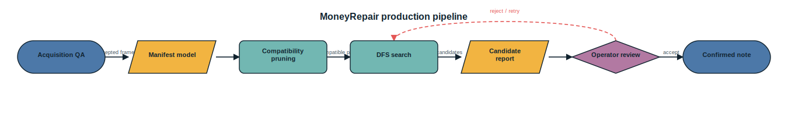
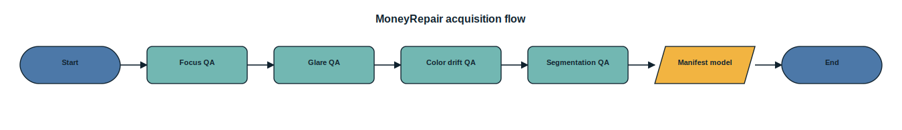
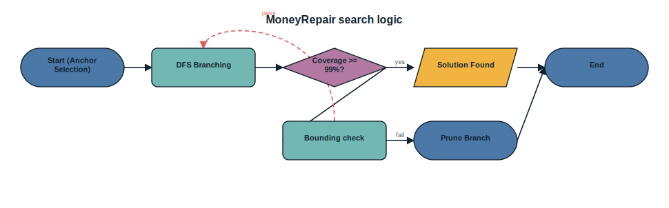
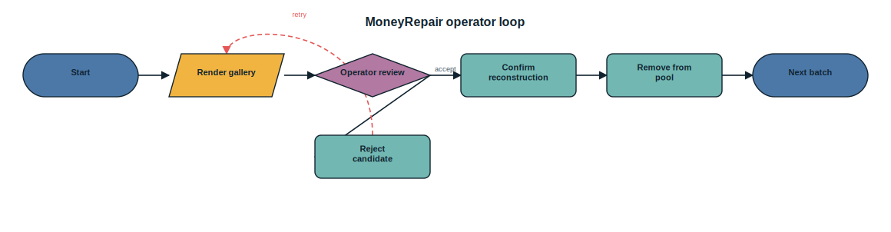

# MoneyRepair

MoneyRepair is a small, testable simulation project for reconstructing shredded
banknotes from fragment compatibility evidence.

The first implementation focuses on the workflow where each fragment already has
an approximate position on the note:

1. Generate or load fragment masks in note coordinates.
2. Build a pairwise compatibility matrix. Two fragments are incompatible when
   their occupied pixels overlap beyond a tolerance.
3. Store the matrix as packed bits.
4. Run a depth-first coverage search to find fragment sets covering a target
   fraction of the note.
5. Render candidate solutions for manual inspection.

It also includes early contour utilities: boundary extraction, coarse tags
(`edge`, `corner`, `center`), affine point transforms, and curve similarity.

## Setup

With WSL Anaconda or Miniconda:

```bash
conda create -n moneyrepair python=3.11 -y
conda activate moneyrepair
pip install -e ".[dev]"
```

Or from the checked-in environment file:

```bash
conda env create -f environment.yml
conda activate moneyrepair
```

## Smoke run

```bash
moneyrepair smoke --output-dir runs/smoke --pieces 18 --coverage 0.98
```

The smoke command writes a synthetic dataset, packed compatibility matrix,
solution JSON, and PNG visualizations.

## Individual commands

```bash
moneyrepair simulate --output data/demo.npz --pieces 24 --width 420 --height 180
moneyrepair build-matrix --dataset data/demo.npz --output data/demo_matrix.npz
moneyrepair solve --dataset data/demo.npz --matrix data/demo_matrix.npz --output data/solutions.json --coverage 0.99
moneyrepair visualize --dataset data/demo.npz --solutions data/solutions.json --output-dir data/vis --report data/report.html
```

## Real image manifest

For photos or scans, start from a JSON manifest that tells the software where
each fragment image sits on the reference note after affine placement:

```json
{
  "note": {"width": 420, "height": 180},
  "fragments": [
    {
      "id": "frag-0001",
      "label": "0001",
      "side": "front",
      "image": "fragments/0001.png",
      "mask": "masks/0001.png",
      "affine_to_note": [[1, 0, 120], [0, 1, 36]]
    }
  ]
}
```

Then run:

```bash
moneyrepair ingest-manifest --manifest data/manifest.json --reference-front data/rmb100_front.png --output data/real_fragments.npz
moneyrepair score-reference --dataset data/real_fragments.npz --reference-front data/rmb100_front.png --reference-back data/rmb100_back.png --output data/reference_scores.json --best-side
moneyrepair build-matrix --dataset data/real_fragments.npz --reference-scores data/reference_scores.json --max-reference-rmse 35 --output data/real_matrix.npz
moneyrepair solve --dataset data/real_fragments.npz --matrix data/real_matrix.npz --coverage 0.99 --output data/real_solutions.json
moneyrepair visualize --dataset data/real_fragments.npz --solutions data/real_solutions.json --output-dir data/real_vis --report data/real_report.html
```

See [docs/pipeline.md](docs/pipeline.md) for the data model and pruning notes.

## Segment one scan/photo

For a clear scan or photo with separated fragments on a simple background:

```bash
moneyrepair segment-scan --image data/scan_001.png --output-dir data/scan_001_segments --threshold 28 --min-area 200 --padding 6
moneyrepair label-manifest --manifest data/scan_001_segments/manifest.json --labels-file data/labels.csv --overwrite
moneyrepair ingest-manifest --manifest data/scan_001_segments/manifest.json --output data/scan_001_fragments.npz
```

`segment-scan` writes RGBA crops, binary masks, and a manifest. Labels default
to generated ids such as `f00000`; pass `--labels-file labels.csv` to override
them with a two-column `id,label` or `index,label` file. Full OCR can be added
later behind the same manifest `label` field.

Optional OCR is available if `pytesseract` and a local Tesseract executable are
installed:

```bash
pip install -e ".[ocr]"
moneyrepair label-manifest --manifest data/scan_001_segments/manifest.json --method ocr --roi 0,0,1,0.25 --overwrite
```

## Precomputed pair records

If pairwise comparison has already been computed elsewhere, import it directly:

```bash
moneyrepair import-pairs --dataset data/real_fragments.npz --pairs data/incompatible_pairs.csv --relation incompatible --output data/imported_matrix.npz
moneyrepair solve --dataset data/real_fragments.npz --matrix data/imported_matrix.npz --coverage 0.99 --output data/imported_solutions.json
```

The pair file can be CSV, TSV, or whitespace-delimited text with two ids per
line. With `--relation incompatible`, all unspecified pairs are considered
compatible. With `--relation compatible`, all unspecified pairs are considered
incompatible.

To estimate matrix memory before a large run:

```bash
moneyrepair estimate-matrix --fragments 20000 --output data/matrix_footprint.json
moneyrepair benchmark-synthetic --pieces 120 --width 600 --height 260 --coverage 0.98 --output data/benchmark_120.json
moneyrepair benchmark-strategies --pieces 120 --width 600 --height 260 --coverage 0.98 --output data/strategy_benchmark.json
moneyrepair report-strategies --input data/strategy_benchmark.json --output-prefix data/strategy_report
```

`benchmark-synthetic` times synthetic data generation, compatibility matrix
construction, and DFS search. Use it for machine-local sanity checks before a
large WSL/Anaconda run. `report-strategies` requires matplotlib; install it with
`pip install -e ".[reports]"` if your environment does not already include it.

## Batch reconstruction

For the "search a candidate, inspect it, confirm it, then move faster" workflow:

```bash
moneyrepair batch-next --dataset data/real_fragments.npz --matrix data/real_matrix.npz --state data/batch_state.json --output-dir data/batch_0001 --coverage 0.99 --max-solutions 10
moneyrepair batch-confirm --state data/batch_state.json --candidates data/batch_0001/candidates.json --index 0 --note-id note-0001
moneyrepair batch-next --dataset data/real_fragments.npz --matrix data/real_matrix.npz --state data/batch_state.json --output-dir data/batch_0002 --coverage 0.99 --max-solutions 10
```

`batch-next` writes `candidates.json`, a `vis/` directory, and `report.html`.
`batch-confirm` records the accepted candidate and removes those fragments from
future searches. Use `batch-reject` when a visually bad candidate should not be
shown again. Both accept `--operator` and `--reason`, recorded in the batch
state audit log.

## Production pipeline (v2.0)

v2.0 makes production tradeoffs: gate capture quality, prune fast, search, and
keep everything auditable. See
[docs/v2.0 industrial algorithm](docs/v2_0_industrial_algorithm.md).

Score acquisition quality against the contract (focus, glare, segmentation
confidence, color drift):

```bash
moneyrepair assess-quality --dataset data/real_fragments.npz --use-reference --output data/quality.json
```

Build the compatibility matrix with the grid-accelerated engine for large
fragment counts, optionally streaming incompatible pairs without a dense matrix:

```bash
moneyrepair build-matrix --dataset data/real_fragments.npz --engine fast --pairs-out data/incompatible_pairs.csv --output data/real_matrix.npz
```

Run one auditable batch end to end. It gates frames on the quality contract,
prunes, searches with the `area_degree` strategy, renders candidates, and writes
`run_manifest.json` with input hashes, parameters, timings, and the QA summary:

```bash
moneyrepair run-pipeline --dataset data/real_fragments.npz --output-dir data/run_0001 --coverage 0.99 --max-solutions 10
```

## Scientific reporting & diagram export (v2.5)

v2.5 turns benchmark and QA artifacts into a polished, auditable report, and exports editable Visio-style diagrams. See [docs/v2.5 scientific reporting](docs/v2_5_scientific_reporting.md).

### 1. Scientific Evidence Figures
Render the multi-panel evidence figure (QA, strategy timing, matrix footprint, coverage). Each figure ships a `*_data.csv` source data table and a `*_manifest.json` metadata file containing per-panel claims and SHA-256 provenance hashes for every source artifact:

```bash
moneyrepair report-figures --output-prefix runs/report \
  --strategy-benchmark runs/strategy_benchmark.json \
  --quality clean=runs/qa_clean.json --quality degraded=runs/qa_degraded.json \
  --claim "Approximate placement plus pairwise incompatibility yields a small inspectable candidate set."
```

### 2. Visio-Style Process Diagrams
MoneyRepair supports exporting fully editable process flowcharts. Each flowchart is exported into three formats:
1. **`.json`**: Structural node/edge model.
2. **`.svg`**: High-quality vector graphic with editable `<text>` elements (rendered directly in the repository/documentation).
3. **`.vsdx`**: Native Microsoft Visio format (automatically generated using local Visio COM automation on Windows).

To export a diagram, run the CLI:
```bash
moneyrepair export-diagram --name <diagram-name> --output-prefix docs/<output-name>
```

#### Available Diagrams:

##### Production Pipeline (`production-pipeline`)
Core reconstruction workflow from image acquisition to operator confirmation.


##### Image QA Gating (`acquisition-flow`)
Sequential quality gates (focus, glare, segmentation, color drift) evaluating incoming fragment frames.


##### DFS Search Logic (`search-logic`)
Branch-and-bound depth-first search (DFS) candidate solver logic showing backtracking and pruning.


##### Operator Audit Loop (`operator-loop`)
Human-in-the-loop interactive review, confirmation, rejection, and fragment pool exhaustion flow.


Quantitative panels stay in Python (`matplotlib`, install with `pip install -e ".[reports]"`) for reproducibility; the schematics stay editable for methods diagrams, following the Visio-oriented references listed in the [reporting doc](docs/v2_5_scientific_reporting.md).

## Honest multi-note testbed (v3.0)

Single-note simulation made every test pass while hiding the hard case. v3.0
adds the **chimera testbed** and the discrimination fix. See
[docs/v3.0 chimera discrimination](docs/v3_0_chimera_discrimination.md).

Build a pool of N identical-denomination notes (one shared layout, per-note
appearance and serial, true `note_id` recorded for diagnosis), then run the
existing solver on an overlap-only matrix vs an appearance-discriminated one:

```bash
moneyrepair simulate-multi-note --output runs/pool.npz --notes 5 --pieces-per-note 10
moneyrepair diagnose-chimeras --dataset runs/pool.npz --vis-dir runs/diag --output runs/diag.json
```

`diagnose-chimeras` reports how many candidate solutions are chimeras (mixing
fragments from different notes). Overlap-only pruning produces ~90% chimeras;
adding discrimination drops it to zero and recovers every note:

```bash
moneyrepair build-matrix --dataset runs/pool.npz --discriminate appearance --output runs/matrix.npz
moneyrepair solve --dataset runs/pool.npz --matrix runs/matrix.npz --coverage 0.97 --output runs/solutions.json
```

Discrimination uses a per-fragment appearance fingerprint measured against the
template (so it depends on the note, not the region), or serial labels with
`--discriminate serial`. Limits and the residual hard tail are documented in the
[v3.0 note](docs/v3_0_chimera_discrimination.md).

## Chimera pressure realism (v4.1)

v4.1 adds the pressure tests that the friendly v3.0 case could not answer:
larger note pools, realistic low appearance spread, and a spatial wear model
that a global RGB-gain fingerprint cannot perfectly invert. See
[docs/v4.1 pressure realism](docs/v4_1_pressure_realism.md).

Smoke profile:

```bash
moneyrepair pressure-chimeras --mode n-sweep --notes-list 3,8,20 --seeds 7 --time-limit 5 --output runs/pressure_smoke.json
```

Longer pressure runs:

```bash
moneyrepair pressure-chimeras --mode n-sweep --notes-list 3,8,20,40,80,150 --appearance-spread 0.18 --seeds 7,8,9 --output runs/pressure_n.json
moneyrepair pressure-chimeras --mode spread-sweep --notes 30 --spread-list 0.18,0.10,0.06,0.04,0.02 --wear-model spatial --seeds 7,8,9 --output runs/pressure_spread.json
moneyrepair pressure-chimeras --mode n-sweep --notes-list 3,8,20 --appearance-spread 0.04 --wear-model spatial --partition-model per_note --include-interlock --seeds 7,8,9 --output runs/pressure_interlock.json
```

The key field is `cluster_exact_recoverable_rate`: it is computed before DFS,
so it is not hidden by the `max_solutions=20` top-k cap. `cluster_count` and
`mixed_note_count` expose the identity merges that create chimeras at scale.
The interlock path is a placed-fragment validator: candidate masks must already
share note coordinates; it is not a raw-crop torn-edge searcher over arbitrary
translation or rotation.

## Production-grade auto-locator & pose solver (v4.0)

v4.0 shifts the system from a pipeline where approximate fragment placement is given beforehand to a simulation-backed end-to-end prototype that automatically estimates translation, rotation, and side placement candidate poses, and solves them using JIT-accelerated algorithms. See [docs/v4.0 production reconstruction](docs/v4_0_production_reconstruction.md) and [docs/v4.0 algorithm deduction](docs/v4_0_algorithm_deduction.md).

### 1. Hybrid Coarse-to-Fine Pose Locator
Finding the optimal $X$, $Y$, rotation ($0^\circ, 90^\circ, 180^\circ, 270^\circ$), and side (front/back) configuration can be slow on large note templates. `locator.py` implements a hybrid matching pipeline:
- **Pyramid Downsampling**: Constructs a 2x resolution pyramid (Level 1) of both reference templates and fragment crops.
- **Numba JIT-compiled Coarse Loop**: Executes a highly optimized sliding-window matching loop at Level 1 to identify the Top-10 candidate configurations.
- **Level 0 Fine Refinement**: Evaluates a narrow neighborhood grid at full resolution around the coarse candidates to find the optimal translation and rotation.

For programmatic usage:
```python
from moneyrepair.locator import locate_fragment_poses
# Estimates Top-K CandidatePose objects containing tx, ty, angle, side, and score
poses = locate_fragment_poses(fragment, template_front, template_back, top_k=3, coarse_step=8)
```

### 2. Zero-Allocation Two-Tier Solver
To reduce the combinatorial explosion of searching through multiple candidate poses, the branch-and-bound solver introduces:
- **Numba-Accelerated Scalar Pruning**: Replaces high-overhead NumPy fancy indexing (`areas[candidates]`) with a zero-allocation flat sum helper (`sum_candidate_areas`).
- **Precise Bounding Threshold**: Uses `--precise-bound-threshold` (default 24) to configure when the solver switches from fast scalar area estimation to precise pixel-accurate geometry check.
- **Optional Touch Priority**: The DFS can prioritise candidates that touch the current assembly, and `--no-touch-priority` disables that preordering when virtual pose counts make the touch matrix too expensive.
- **Experimental Adjacency/Boundary Color Continuity**: Uses `--max-boundary-diff` (disabled by default at `-1.0`) to check color transitions across touching borders using a Numba JIT helper. Note that lighting variations and shadows on real photos make boundary color matches unstable; this should remain disabled (set to negative) in default production runs and treated purely as an experimental hard pruning option.

### 3. Integrated Production Command
Run raw-crop auto-location without appearance discrimination; current appearance
fingerprinting assumes fragments are already in template coordinates:

```bash
moneyrepair run-pipeline \
  --dataset runs/pool.npz \
  --output-dir runs/final \
  --auto-locate \
  --score-margin 0.03 \
  --min-score 0.70 \
  --precise-bound-threshold 24 \
  --coverage 0.97
```

For a pre-aligned simulation pool, appearance discrimination can be enabled:

```bash
moneyrepair run-pipeline \
  --dataset runs/pool.npz \
  --output-dir runs/final_aligned \
  --auto-locate \
  --discriminate-appearance \
  --coverage 0.97
```

When `--auto-locate` is enabled:
1. Candidate poses are generated for all active fragments.
2. The Top-K candidate configurations are stored in `pose_candidates.json` for auditing and manual verification.
3. Virtual placed fragments are constructed and solved using the zero-allocation DFS engine.
4. Detailed performance metrics, including `jit_warmup` and `total_without_jit_warmup`, are logged in `run_manifest.json` along with input hashes and absolute paths.

## Current scope

This is intentionally a software simulation first. Real scan/photo ingestion can
plug into the same fragment model once masks, approximate affine placement, and
labels are available. The current real-input path assumes labels are provided by
the manifest or encoded in filenames; full OCR can be added later behind the same
manifest field.

## Contributing

Run `python -m pytest -q` and `python -m compileall -q src` before publishing
changes. See [CONTRIBUTING.md](CONTRIBUTING.md).

For GitHub publishing steps, see [docs/github.md](docs/github.md).

Version planning:
[v1.5 experiments](docs/v1_5_experiments.md),
[v2.0 industrial algorithm](docs/v2_0_industrial_algorithm.md),
[v2.5 scientific reporting](docs/v2_5_scientific_reporting.md),
[v3.0 chimera discrimination](docs/v3_0_chimera_discrimination.md), and
[v4.0 production reconstruction](docs/v4_0_production_reconstruction.md) (with [algorithm deduction](docs/v4_0_algorithm_deduction.md) and [performance convergence report](docs/stage4_convergence_report.md)),
plus [v4.1 pressure realism](docs/v4_1_pressure_realism.md).
