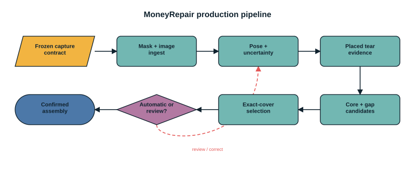

# MoneyRepair

**MoneyRepair** is a simulation-backed, geometry-first research prototype for reconstructing hand-torn near-identical banknotes and paper documents.

It registers torn fragments to a canonical banknote frame, extracts physical tear-boundary coincidence, evaluates adaptive evidence ($E_{\text{tear}}$) and whole-assembly gap fit ($G$), and solves globally consistent non-overlapping, serial-deduplicated assemblies using exact-cover branch-and-bound search.

---

> [!IMPORTANT]
> **Authoritative System Status & Boundaries:**
> All measured metrics, capability bounds ($N=20 \sim 200$, $p=8 \sim 24$), documented dead ends, and future resume-paths are governed by **[STATUS.md](STATUS.md)** in the repository root. No claim elsewhere in this repository may exceed what `STATUS.md` supports.

---

## 🏛️ System Architecture

MoneyRepair is structured around an end-to-end batch processing pipeline:

```
[ Scan / Raw Photo ] ──► [ 1. Quality QA Gate ] ──► [ 2. Auto-Locator ]
                                                           │
[ Operator Confirmation ] ◄── [ 4. Exact-Cover Solver ] ◄── [ 3. Compatibility Matrix ]
```



- **1. Quality QA Gate**: Evaluates focus (Laplacian variance), glare (luminance clipping), and mask solidity.
- **2. Auto-Locator**: Estimates candidate poses (X, Y, 0°/90°/180°/270°, front/back) using Numba JIT coarse-to-fine template matching.
- **3. Compatibility Matrix**: Evaluates spatial overlap, placed tear evidence, and serial constraints. Appearance remains an optional tie-breaker, not a note-identity key.
- **4. Exact-Cover Solver**: Runs zero-allocation branch-and-bound search over packed bit-matrices to find optimal note assemblies.
- **5. Interactive Review Loop**: Presents candidate reports to operators for confirmation or rejection.

---

## 🚀 Quickstart & Setup

### Environment Setup

With WSL Anaconda or Miniconda:

```bash
conda create -n moneyrepair python=3.11 -y
conda activate moneyrepair
pip install -e ".[dev]"
```

Or from the checked-in environment file:

```bash
conda env create -f environment.yml
conda activate moneyrepair
```

### 1. Synthetic Pipeline Smoke Test

Run an end-to-end synthetic reconstruction:

```bash
moneyrepair smoke --output-dir runs/smoke --pieces 18 --coverage 0.98
```

### 2. v4.3 Mechanism Ablation ($p=8, 16, 24$)

Run same-seed A/B ablation comparing `baseline`, `effectiveness`, `effectiveness_gap`, and `v43_routed`:

```bash
moneyrepair tearfit-v43-ablation \
  --notes 5 \
  --pieces-list 8,16,24 \
  --seeds 7,13 \
  --output runs/v4_3_ablation.json
```

### 3. v4.3.2 Scale-Fineness Audit

Calibrate an unsaturated N=20 compute anchor, then compare a fixed production
budget with workload-normalized p=24 scaling. Each completed seed/track case is
written to JSONL so a long run can resume without repeating completed work:

```bash
moneyrepair tearfit-v432-scale \
  --notes-list 20,50,100,200 \
  --pieces-per-note 24 \
  --seeds 7,8,9 \
  --anchor-budget-factors 1,2,4,8 \
  --checkpoint runs/v4_3_2/checkpoint.jsonl \
  --output runs/v4_3_2/report.json
```

Resume with the same arguments plus `--resume`. The normalized track is skipped
when adjacent anchor budgets do not stabilize the selected assemblies and
candidate-provenance fingerprint; an already truncated N=20 run is never used
as a scaling baseline.

### 4. Production Batch Pipeline

Run an auditable pipeline batch with quality gating and run manifest generation:

```bash
moneyrepair run-pipeline \
  --dataset runs/smoke/demo_fragments.npz \
  --output-dir runs/production_run \
  --auto-locate \
  --coverage 0.97
```

---

## 📊 v4.3 Mechanism Ablation Performance

Measured performance across $p=8, 16, 24$ regimes under deterministic search budgets (N=20, seeds 7/8/9):

| 路线 / 算法 | $p=8$ Yield (Prec) | $p=16$ Yield (Prec) | $p=24$ Yield (Prec) | 伪边率 (False Edge) | 核心作用与能力界定 |
| :--- | :---: | :---: | :---: | :---: | :--- |
| **`baseline`** (固定重叠) | 1.00 (1.00) | 1.00 (1.00) | 0.53 (0.85) | 0.069 ~ 0.094 | 粗碎片高速；细碎片候选图拥堵。 |
| **`effectiveness`** (Etear 边得分) | 0.92 (0.98) | 0.93 (0.95) | 0.77 (0.82) | **0.002 ~ 0.036** | 清理错误边并降低候选拥堵；单独使用不保证最终精度。 |
| **`effectiveness_gap`** (Etear + Gap 填补) | 0.95 (1.00) | **0.98 (1.00)** | **0.92 (0.98)** | **0.002 ~ 0.036** | 少量全局缺口候选同时改善召回与最终选择。 |
| **`v43_routed`** (自适应路由) | **1.00 (1.00)** | **1.00 (1.00)** | **0.92 (0.98)** | 0.036 ~ 0.086 | p=8/16 复用 baseline，p=24 启用 Etear + Gap。 |

See **[docs/v4_3_1_mechanism_validation.md](docs/v4_3_1_mechanism_validation.md)** for the canonical N=20 mechanism audit and **[docs/v4_3_tear_effectiveness.md](docs/v4_3_tear_effectiveness.md)** for the score definition.

The v4.3.2 workload-normalized checkpoint retains routed p=24
yield/precision `0.880/0.985` at N=50 (three seeds). The first N=100 seed
diagnostic is `0.840/0.966`, with oracle candidate recall also `0.840`; this
places the measured failure before exact cover, in edge discrimination and/or
gap proposal. N=100 replication, N=200, and real-data validation remain open.
See **[docs/v4_3_2_scale_fineness.md](docs/v4_3_2_scale_fineness.md)**.

---

## 📚 Documentation Directory

Explore the complete documentation in **[docs/README.md](docs/README.md)**:

- **[Pipeline Notes](docs/pipeline.md)**: Production pipeline, quality gates, DFS logic, and operator loop.
- **[v4.3 Adaptive Geometry](docs/v4_3_tear_effectiveness.md)**: Math formulas for $E_{\text{tear}}$ and whole-assembly gap fit $G$.
- **[v4.3.1 Mechanism Validation](docs/v4_3_1_mechanism_validation.md)**: Canonical N=20 edge, gap, routing, and search-budget decomposition.
- **[v4.3.2 Scale-Fineness Protocol](docs/v4_3_2_scale_fineness.md)**: Anchor calibration, fixed/normalized compute tracks, oracle candidate recall, and bottleneck rules.
- **[v4.3 N=10 Supplemental Audit](docs/v4_3_ab_benchmark.md)**: Smaller-pool consistency check, not the headline benchmark.
- **[Auto-Locator Deduction](docs/v4_0_algorithm_deduction.md)**: Mathematical analysis and proofs for JIT template matching.
- **[Chimera Discrimination](docs/v3_0_chimera_discrimination.md)**: DBSCAN tone gain clustering and multi-note pool hardening.

---

## 🧪 Testing

Run unit and integration tests across Linux/WSL and Windows:

```bash
# Run core test suite (torch-free)
python -m pytest -m "not experimental"

# Run full test suite
python -m pytest
```

---

## 📜 License & Governance

MoneyRepair is licensed under the MIT License. See [LICENSE](LICENSE) for details.
Governance and contribution principles are detailed in [AGENTS.md](AGENTS.md) and [CONTRIBUTING.md](CONTRIBUTING.md).
