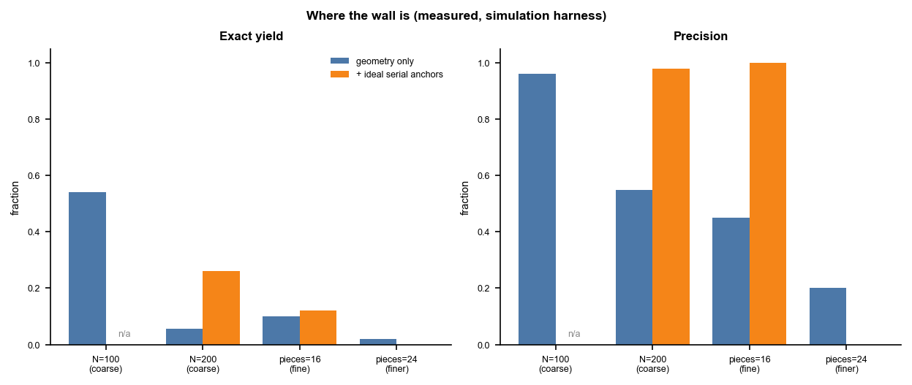
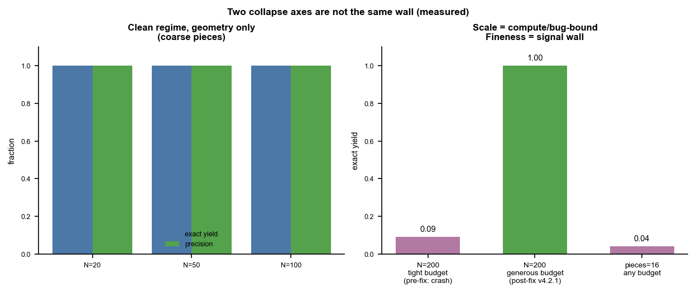

# MoneyRepair — STATUS (authoritative)

> Single source of truth. Every number below is measured **in the simulation
> harness** (per-note fractal tears + fraying), not on real torn notes. No claim
> elsewhere in this repo may exceed what this table supports.

## What this is

A geometry-first reconstruction system for hand-torn near-identical banknotes.
It registers each fragment to the canonical note, then links fragments that are
**two sides of one physical tear** (tear-boundary coincidence in absolute
coordinates), then assembles notes by generating full-note candidates and
selecting a globally consistent (non-overlapping, serial-deduplicated) set via
exact-cover. Serial numbers (冠字号), when legible, act as hard anchors + dedup
constraints; appearance is at most a tie-breaker.

## What works (measured, simulation)

- **Discriminator.** Tear-boundary coincidence in absolute coordinates cleanly
  separates true tear-mates from mere abutment: ~**99% of false joins rejected**
  on fractal tears. (Contact-count and colour-continuity do not — see dead ends.)
- **Assembly.** Generate-then-select **exact-cover is robust to the residual
  false-edge rate** (bad candidates fail the tile/coverage test and are dropped),
  unlike greedy single-linkage which chains all notes into one blob.
- **Clean regime, geometry only (no serial), per-note fractal tears + fray:**

  | N notes | exact yield | precision |
  |---|---|---|
  | 20  | 1.00 | 1.00 |
  | 50  | 1.00 | 1.00 |

  This is real and well past every earlier discriminator.

## Where the wall is (measured, simulation)

The two properties that **define the real case — many notes, finely torn — break it**,
and even *ideal* serial anchors (every note anchored, perfect OCR) do not restore yield:

| stressor | geometry only | + ideal serial anchors |
|---|---|---|
| N=100 (coarse) | yield 0.54, prec 0.96 | — |
| N=200 (coarse) | yield 0.055, prec 0.55 | yield 0.26, prec 0.98 |
| pieces=16 (finely torn) | yield ~0.10, prec ~0.45 | yield 0.12, prec 1.00 |
| pieces=24 (finer)        | yield ~0.02, prec ~0.20 | yield 0.00, prec 0.00 |

Heavy fraying *alone* on coarse pieces is tolerated (yield 1.00). **Fineness and
scale are the killers, not fray.** Serials rescue *precision* (the no-duplicate-serial
constraint blocks chimeras) but not *yield*: the many small pieces per note cannot be
reliably chained by short, frayed tears.

## Figures (measured)

These plot the tables above. Regenerate with
`python docs/figures/make_figures.py` (matplotlib).

*Left (exact yield):* yield falls off as the pool grows (N) or the pieces get
finer, and ideal serial anchors barely lift it — the orange bars stay low.
*Right (precision):* the same ideal serials push precision back to ~1.0 (the
no-duplicate-serial constraint blocks chimeras). So **serials rescue precision,
not yield**: knowing each note's identity stops bad merges, but the many short,
frayed tears in a finely-torn note still cannot be chained, so most notes are
never assembled at all. `n/a` marks N=100, which was not run with the serial
column.

*Left:* in the clean regime (coarse pieces, geometry only) the system recovers
every note exactly — yield and precision both 1.0 at N=20/50/100. *Right:* the
two failure axes differ in kind. **Scale (large N)** was a fixable engineering
problem: the exact-cover search crashed (`RecursionError`) on large candidate
pools, so N=200 read as ~0.09; with the crash fixed (v4.2.1) and an adequate
budget it recovers to 1.0. **Fineness (pieces=16+)** is the genuine signal wall —
short frayed tears carry too little absolute-coordinate evidence, so it stays at
~0.04 no matter the compute. Only a better fine-tear descriptor (or the human
queue) can move that bar.

## Honest operating stance

**High-precision automatic confirmation of the easy minority + a human review queue
for the finely-torn bulk.** Not full-auto for finely-torn 2000-note cases. The system's
value is making human assemblers faster on the pieces that *are* cleanly recoverable —
not replacing them. (This is why the real-world case used a 13-person team.)

## Dead ends — do NOT re-attempt thinking they are new

| approach | why it fails |
|---|---|
| appearance / wear gain clustering | under spatially non-uniform wear, same-note pieces no longer share one gain → 0 exact recovery even at N=3 |
| boundary-colour continuity | no threshold separates true seams from false (wear/stains cross seams); tight cuts true joins, loose readmits chimeras |
| interlock contact-count | measures how much pieces touch, not whether tear profiles mate → no-op when loose, severs true seams when tight |
| whole-contour similarity matching | rotation-invariant best-subsegment over the full boundary → straight non-tear edges give spurious matches; it *inverts* on jagged input; also never wired into the solver |

All four reduce a high-dimensional signal (the tear-edge profile) to a scalar
threshold whose true/false distributions overlap. That is the recurring trap.

## The one resume-path (if anyone continues)

Exactly two pieces of work, both narrow:

1. **Learned fine-tear edge descriptor** — replace the scalar coincidence with a
   model on the actual tear-edge profile (turning-angle/curvature sequence, or a
   small CNN on the resampled edge), trained to discriminate true vs false
   tear-mates **specifically on fine, frayed edges**, and benchmarked head-to-head
   against scalar coincidence **on the pieces=16/24 regime**. This is the only lever
   that could move the fineness wall.
2. **Faster assembly for scale** — numba/C exact-cover + spatial-hash candidate
   generation, so N≈hundreds–thousands does not hit time limits.

> Honest expectation: prior rounds strongly suggest (1) **shifts the wall, not removes
> it** — the triage stance above probably still holds for finely-torn near-identical notes.

## The single highest-value untaken step

Not more algorithms: **tear a few real notes, photograph them, and run the whole
pipeline (including registration) on real fray.** Everything above is simulation.
The fastest way to learn something true now is to hit it with reality.

## Status of the codebase

- **CORE** (`tearfit`, `locator`, `simulate`, `pressure`, `diagnostics`, `compat`,
  `solver`, `batch`, acquisition/IO, CLI): the supported, runnable system. Installs
  and runs without torch.
- **baselines/**: superseded discriminators kept for comparison only.
- **experimental/** (`v6_to_v10` DL stack, `llm_control`, `policy_compare`):
  UNVERIFIED, untrained, opt-in. Not part of the supported pipeline. They do not
  currently beat the deterministic exact-cover and have not been benchmarked on the
  regime that actually matters (fine fragments).
