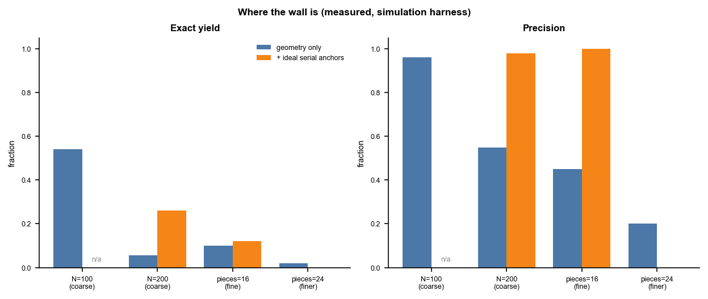
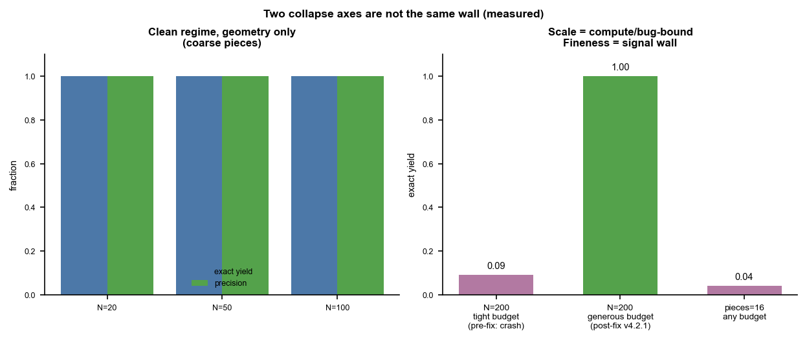

# MoneyRepair — STATUS (authoritative)

> Single source of truth. Every number below is measured **in the simulation
> harness** (per-note fractal tears + fraying), not on real torn notes. No claim
> elsewhere in this repo may exceed what this table supports.

## What this is

A geometry-first reconstruction system for hand-torn near-identical banknotes.
It registers each fragment to the canonical note, then links fragments that are
**two sides of one physical tear** (tear-boundary coincidence in absolute
coordinates), then assembles notes by generating full-note candidates and
selecting a globally consistent (non-overlapping, serial-deduplicated) set via
exact-cover. Serial numbers (冠字号), when legible, act as hard anchors + dedup
constraints; appearance is at most a tie-breaker.

## What works (measured, simulation)

- **Discriminator.** Tear-boundary coincidence in absolute coordinates cleanly
  separates true tear-mates from mere abutment: ~**99% of false joins rejected**
  on fractal tears. (Contact-count and colour-continuity do not — see dead ends.)
- **Assembly.** Generate-then-select **exact-cover is robust to the residual
  false-edge rate** (bad candidates fail the tile/coverage test and are dropped),
  unlike greedy single-linkage which chains all notes into one blob.
- **Clean regime, geometry only (no serial), per-note fractal tears + fray:**

  | N notes | exact yield | precision |
  |---|---|---|
  | 20  | 1.00 | 1.00 |
  | 50  | 1.00 | 1.00 |

  This is real and well past every earlier discriminator.
- **v4.3 fine-fragment shift, fixed search budgets, N=20, no serial:** the
  complexity-routed policy keeps fixed overlap for p=8/16 and activates adaptive
  tear evidence plus group-gap recovery at p=24.

  | pieces | fixed overlap yield / precision | v4.3 routed yield / precision |
  |---:|---:|---:|
  | 8  | 1.000 / 1.000 | 1.000 / 1.000 |
  | 16 | 1.000 / 1.000 | 1.000 / 1.000 |
  | 24 | 0.533 / 0.846 | **0.917 / 0.981** |

  These are means over seeds 7/8/9 with deterministic state/node budgets. The
  p=24 false-edge rate falls from 0.094 to 0.036 and the mean human queue from
  9.3 to 1.7 notes, at about 2.3x runtime. See
  [the v4.3 report](docs/v4_3_tear_effectiveness.md).

- **v4.3.1 mechanism audit:** at p=24, Etear reduces accepted edges from 881.0
  to 628.0 and false accepted edges from 82.7 to 22.7, cutting candidate count
  from 9581.3 to 5519.3 under the fixed search budget. Group-gap then adds only
  57.7 candidates, of which 2.7 are selected, raising yield/precision from
  0.767/0.817 to 0.917/0.981. Only 0.3 selected candidates per run are unique
  to low-coverage partial cores. Routing reuses baseline at p=8/16 and the gap
  path at p=24; it avoids unnecessary heavy search rather than changing an
  already-resolved trial. See the
  [v4.3.1 mechanism report](docs/v4_3_1_mechanism_validation.md).

- **v4.3.2 scale-fineness checkpoint:** the N=20 budget staircase stabilizes at
  2x. Under workload-normalized compute, routed p=24 remains at
  `0.880/0.985` yield/precision at N=50 (seeds 7/8/9), versus `0.300/0.764`
  under the original fixed budget. N=50 passes every preregistered quality and
  mechanism gate. The first N=100 seed diagnostic reaches
  `0.840/0.966`, with oracle candidate recall also `0.840`; core/gap searches
  are unsaturated and exact cover selects every available exact candidate.
  False-edge rate rises from `0.036` (N=20) to `0.071` (N=50) and `0.135`
  (N=100 seed 7), while true-edge recall stays near `0.37`. This locates the
  measured wall before exact cover, in candidate evidence (edge
  discrimination and/or gap proposal). N=100 seeds 8/9 and N=200 remain
  unmeasured, so N=100 is a diagnostic, not a replicated headline result. See
  [the v4.3.2 report](docs/v4_3_2_scale_fineness.md).

- **v4.3.3 causal falsification:** the paired N=100, p=24, seed-7 control
  exactly reproduces `oracle candidate recall = exact yield = 0.840`. An oracle
  intervention then removes all 466 false core edges and all 2,064 accepted
  cross-note edges while preserving every accepted true edge, with every
  threshold and search budget unchanged. Oracle recall reaches only `0.860`
  (`+0.020`), below the preregistered `+0.050` rescue gate. False edges are a
  workload burden (30,828 -> 24,243 candidates; 510.4 -> 396.8 s), but not the
  current yield limiter. Their removal also raises precision from `0.966` to
  `0.989`, so false-edge reduction remains a secondary precision/performance
  lever rather than the v4.4 yield-quality priority. The measured seed-7 wall
  is therefore narrowed from generic candidate evidence to **gap proposal /
  candidate construction**. See [the v4.3.3 report](docs/v4_3_3_oracle_false_edges.md).

- **v4.4 residual-gap candidate proposal (implementation complete):** implements
  a paradigm shift from edge-first expansion to residual-gap-first candidate
  construction (`ResidualGapRegion`). Evaluates proposals using whole-assembly
  before->after improvement ($E_{\text{proposal}}$), applies per-gap complexity
  routing (`simple`, `moderate`, `complex`), prunes non-informative slivers below
  the tolerance scale ($S_{\text{min}}$), and includes funnel diagnostics
  (`v44_candidate_funnel_diagnostic`). All 125 unit/integration tests pass cleanly.
  See [the v4.4 report](docs/v4_4_residual_gap_proposal.md).

- **v4.4 empirical validation (NULL result; bottleneck relocated):** under the
  preregistered N=100, p=24, seed-7 normalized-compute protocol (identical
  same-seed arms; exactly reproduces the v4.3.3 control), residual-gap-first
  construction **did not raise oracle candidate recall** — `0.840 -> 0.840`
  (delta `0.000`), so the `+0.05` rescue gate (`>= 0.890`) was **not** cleared.
  Precision held at `0.9655`; the only measurable effect was `+33.28 s` (`+3.4%`)
  runtime. v4.4 does **not** solve the candidate wall. Two independent findings
  explain the NULL: (1) gap-first was inert here — it found 2,716 residual gap
  regions, all routed `complex`, yet made `0` proposals with neither state nor
  time limit reached; (2) the candidate funnel localizes the binding constraint
  **upstream** of the gap stage — the 16 missing notes are 10 `no_pure_core_base`
  + 6 `pure_core_base_not_selected`, with **zero** misses attributed to the
  weak-pair / gap-proposal gate. So even a fully-firing gap-first stage could not
  rescue those notes. The measured seed-7 wall therefore moves from *gap
  proposal / candidate construction* to **pure core-base construction & base
  selection**. This is one deterministic seed, not a cross-seed claim. See
  [the v4.4 empirical-validation report](docs/v4_4_empirical_validation.md).

## Where the wall is (measured, simulation)

The historical v4.2 pressure runs below show that the two properties defining
the real case — many notes and finely torn notes — break the old fixed-overlap
path, and even ideal serial anchors do not restore yield. The fine-fragment rows
were measured at a larger/harder pool than the v4.3 N=20 ablation and remain an
unresolved scale-plus-fineness target:

| stressor | geometry only | + ideal serial anchors |
|---|---|---|
| N=100 (coarse) | yield 0.54, prec 0.96 | — |
| N=200 (coarse) | yield 0.055, prec 0.55 | yield 0.26, prec 0.98 |
| pieces=16 (finely torn) | yield ~0.10, prec ~0.45 | yield 0.12, prec 1.00 |
| pieces=24 (finer)        | yield ~0.02, prec ~0.20 | yield 0.00, prec 0.00 |

Heavy fraying *alone* on coarse pieces is tolerated (yield 1.00). **Combined
fineness and scale remain the killers, not fray.** Serials rescue precision (the
no-duplicate-serial constraint blocks chimeras) but not yield. v4.3.2 confirms
the adaptive/gap gain at N=50 under normalized compute and locates the first
N=100 seed failure before exact cover. v4.3.3 additionally falsifies accepted
false-edge removal as the dominant quality rescue (`+0.020 < +0.050`) and
narrows that seed-7 failure to gap proposal / candidate construction. v4.4 then
tests residual-gap-first construction against that narrowed wall and returns a
NULL (`0.840 -> 0.840`, `+0.05` gate not cleared): gap-first is inert (2,716
regions, all `complex`, `0` proposals), and the candidate funnel relocates the
binding constraint **upstream to pure core-base construction & base selection**
(10 `no_pure_core_base` + 6 `pure_core_base_not_selected`; zero gap-gate misses).
The measured seed-7 wall is therefore now pure core-base construction and
selection, not the gap-proposal stage. N=100 replication, N=200, and real paper
remain unmeasured.

## Figures (measured)

These plot the tables above. Regenerate with
`python docs/figures/make_figures.py` (matplotlib).

*Left (exact yield):* yield falls off as the pool grows (N) or the pieces get
finer, and ideal serial anchors barely lift it — the orange bars stay low.
*Right (precision):* the same ideal serials push precision back to ~1.0 (the
no-duplicate-serial constraint blocks chimeras). So **serials rescue precision,
not yield**: knowing each note's identity stops bad merges, but the many short,
frayed tears in a finely-torn note still cannot be chained, so most notes are
never assembled at all. `n/a` marks N=100, which was not run with the serial
column.

*Left:* in the clean regime (coarse pieces, geometry only) the system recovers
every note exactly — yield and precision both 1.0 at N=20/50/100. *Right:* the
two failure axes differ in kind. **Scale (large N)** was a fixable engineering
problem: the exact-cover search crashed (`RecursionError`) on large candidate
pools, so N=200 read as ~0.09; with the crash fixed (v4.2.1) and an adequate
budget it recovers to 1.0. **Fineness under a large mixed-note pool** is the
genuine residual signal wall. v4.3 adaptive evidence plus whole-assembly context
moves the p=24 bar through N=50 under normalized compute. The N=100 seed-7
diagnostic shows the next wall is missing exact candidates before final
selection, not an exact-cover failure; the human queue remains part of the
system boundary.

## Honest operating stance

**High-precision automatic confirmation of the easy minority + a human review queue
for the finely-torn bulk.** Not full-auto for finely-torn 2000-note cases. The system's
value is making human assemblers faster on the pieces that *are* cleanly recoverable —
not replacing them. (This is why the real-world case used a 13-person team.)

## Dead ends — do NOT re-attempt thinking they are new

| approach | why it fails |
|---|---|
| appearance / wear gain clustering | under spatially non-uniform wear, same-note pieces no longer share one gain → 0 exact recovery even at N=3 |
| boundary-colour continuity | no threshold separates true seams from false (wear/stains cross seams); tight cuts true joins, loose readmits chimeras |
| interlock contact-count | measures how much pieces touch, not whether tear profiles mate → no-op when loose, severs true seams when tight |
| whole-contour similarity matching | rotation-invariant best-subsegment over the full boundary → straight non-tear edges give spurious matches; it *inverts* on jagged input; also never wired into the solver |

All four reduce a high-dimensional signal (the tear-edge profile) to a scalar
threshold whose true/false distributions overlap. That is the recurring trap.

## The resume-path (if anyone continues)

Four pieces of work, in this order:

1. **Real-data validation** — tear a small set of notes, capture raw crops, and
   measure locator uncertainty, automatic precision, and the human queue. This
   is now more informative than another synthetic architecture layer.
2. **If simulation work continues, improve pure core-base construction &
   selection** — v4.4 falsified residual-gap-first construction as the rescue at
   the measured N=100 seed-7 point (NULL, `+0.05` gate not cleared) and the
   candidate funnel relocated the wall upstream: 10 notes have no pure core base
   and 6 have a pure base that is never selected. Recover a pure core base for
   the notes that lack one, and promote the pure base into the selected solution
   for the notes that have one but rank it too deep. Do not spend the next
   quality iteration only reducing false accepted pairs (v4.3.3 falsified that)
   or only firing gap proposal (v4.4 falsified that as the primary limiter here);
   both remain secondary levers. A follow-up is also open in the `complex`-gap
   routing branch, which currently emits no proposals under normalized budgets.
3. **Learned fine-tear edge descriptor, only if real data requires it** — replace
   the scalar coincidence with a
   model on the actual tear-edge profile (turning-angle/curvature sequence, or a
   small CNN on the resampled edge), trained to discriminate true vs false
   tear-mates **specifically on fine, frayed edges**, and benchmarked head-to-head
   against scalar coincidence **on the pieces=16/24 regime**.
4. **Faster assembly for scale** — numba/C exact-cover + spatial-hash candidate
   generation, so N≈hundreds–thousands does not hit time limits.

> Honest expectation: v4.3 shifts the simulated wall; it does not remove the
> need for triage on finely torn near-identical notes.

## The single highest-value untaken step

Not more algorithms: **tear a few real notes, photograph them, and run the whole
pipeline (including registration) on real fray.** Everything above is simulation.
The fastest way to learn something true now is to hit it with reality.

## Status of the codebase

- **CORE** (`tearfit`, `locator`, `simulate`, `pressure`, `diagnostics`, `compat`,
  `solver`, `batch`, acquisition/IO, CLI): the supported, runnable system. Installs
  and runs without torch.
- **baselines/**: superseded discriminators kept for comparison only.
- **experimental/** (`v6_to_v10` DL stack, `llm_control`, `policy_compare`):
  UNVERIFIED, untrained, opt-in. Not part of the supported pipeline. They do not
  currently beat the deterministic exact-cover and have not been benchmarked on the
  regime that actually matters (fine fragments).
