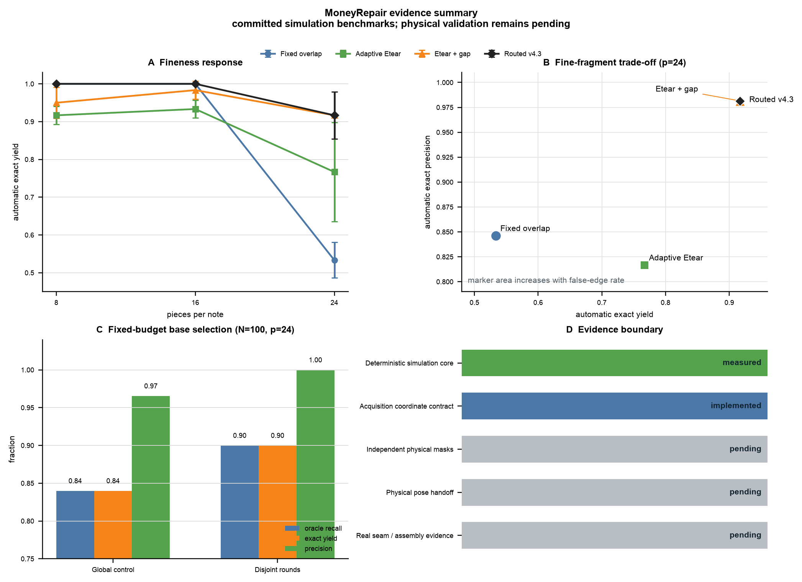

# MoneyRepair Documentation

Start with [the authoritative status](../STATUS.md). This directory separates
current operating guides from measured research reports and historical design
records. Historical files are retained for reproducibility; they do not define
the current capability claim.

## Current Guides

| Document | Purpose |
|---|---|
| [Pipeline](pipeline.md) | current data contracts, acquisition-to-review flow, supported and diagnostic paths |
| [v5 Reality Bridge](v5_reality_bridge.md) | truth-isolated raw-crop mask/pose measurement funnel |
| [Physical Pilot](v5_real_capture_pilot.md) | frozen 64-fragment/72-scene scanner/phone protocol |
| [Literature Transfer Audit](v5_literature_transfer_audit.md) | three-paper measurement transfer and stage stop rule |
| [Release Checklist](release.md) | code, document, artifact, and data-safety checks |
| [GitHub](github.md) | canonical `main` publication and repository maintenance |
| [Research History](research_history.md) | concise chronology from v1 through the current freeze |

## Editable Diagrams

Draw.io is the canonical editable format. JSON is the deterministic graph
source and SVG is the review/publishing form. VSDX can be generated explicitly
with `moneyrepair export-diagram --vsdx`, but it is not checked in.

| Diagram | Draw.io | JSON | SVG |
|---|---|---|---|
| production pipeline | [edit](pipeline_diagram.drawio) | [spec](pipeline_diagram.json) | [view](pipeline_diagram.svg) |
| acquisition and pose handoff | [edit](acquisition_flow.drawio) | [spec](acquisition_flow.json) | [view](acquisition_flow.svg) |
| candidate and exact-cover logic | [edit](search_logic.drawio) | [spec](search_logic.json) | [view](search_logic.svg) |
| operator confirmation loop | [edit](operator_loop.drawio) | [spec](operator_loop.json) | [view](operator_loop.svg) |
| evidence-gated research path | [edit](research_gates.drawio) | [spec](research_gates.json) | [view](research_gates.svg) |

Regenerate any set from code:

```bash
moneyrepair export-diagram \
  --name research-gates \
  --output-prefix docs/research_gates
```

The files are ordinary uncompressed diagrams.net XML and remain editable after
opening in the desktop or web Draw.io application.

## Consolidated Scientific Figure



The source script reads only committed benchmark JSON:

```bash
python docs/figures/make_research_summary.py
```

Outputs are an editable-text SVG and a high-resolution PNG. The figure makes
the evidence boundary visible instead of mixing simulation and physical-data
claims.

## Measured Research Reports

### Frozen deterministic path

| Report | Main result |
|---|---|
| [v4.3 tear effectiveness](v4_3_tear_effectiveness.md) | adaptive physical evidence and assembly-level gap recovery |
| [v4.3.1 mechanism validation](v4_3_1_mechanism_validation.md) | fixed-overlap, Etear, gap, and routing ablation at `N=20` |
| [v4.3.2 scale-fineness](v4_3_2_scale_fineness.md) | normalized compute audit through `N=50`, plus one `N=100` diagnostic |
| [v4.3.3 oracle false-edge test](v4_3_3_oracle_false_edges.md) | false-edge deletion fails the preregistered yield rescue gate |
| [v4.4 residual-gap proposal](v4_4_residual_gap_proposal.md) | residual-gap-first implementation and measurement design |
| [v4.4 empirical validation](v4_4_empirical_validation.md) | NULL result; wall relocates upstream of gap proposal |
| [v4.4.1 base selection](v4_4_1_base_selection.md) | fixed-budget disjoint selection clears the seed-7 rescue gate |

The machine-readable sources are in [benchmarks](benchmarks/). Supplemental
N=10 results in [v4.3 A/B benchmark](v4_3_ab_benchmark.md) are retained for
reproducibility and are not headline evidence.

### v5 physical bridge

| Report | Main result |
|---|---|
| [Reality Bridge](v5_reality_bridge.md) | mask/pose failure localization on annotated synthetic captures |
| [Physical Pilot](v5_real_capture_pilot.md) | physical acquisition contract is frozen; collection remains pending |
| [Literature Transfer Audit](v5_literature_transfer_audit.md) | local rank quality does not remove the component-coverage wall |

## Historical Archive

These files explain how the current design was reached. Their recommendations
may be superseded by `STATUS.md`.

| Era | Documents |
|---|---|
| v1-v2.5 | [realism experiments](v1_5_experiments.md), [industrial algorithm](v2_0_industrial_algorithm.md), [scientific reporting](v2_5_scientific_reporting.md) |
| v3-v4.1 | [chimera discrimination](v3_0_chimera_discrimination.md), [production reconstruction](v4_0_production_reconstruction.md), [algorithm deduction](v4_0_algorithm_deduction.md), [pressure realism](v4_1_pressure_realism.md) |
| solver/tearfit studies | [stage-4 convergence](stage4_convergence_report.md), [tearfit research](tearfit_research.md) |

Historical appearance, colour-continuity, contact-count, and naive
whole-contour discriminators are baselines, not current production advice.

## Evidence Rules

- Simulation metrics must say `simulation` and include seeds and budgets.
- A single deterministic seed may localize a mechanism but is not a replicated
  headline result.
- Evaluation truth must never select a production mask, pose, edge, or
  candidate.
- Real scans, private labels, and generated `runs/` artifacts stay out of Git.
- A new algorithm path is allowed only after the physical pilot identifies the
  first failed stage and the experiment is preregistered.
