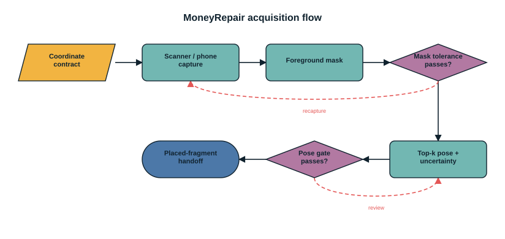
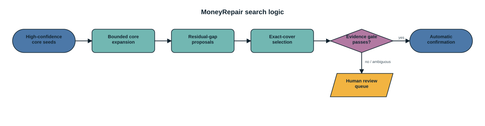
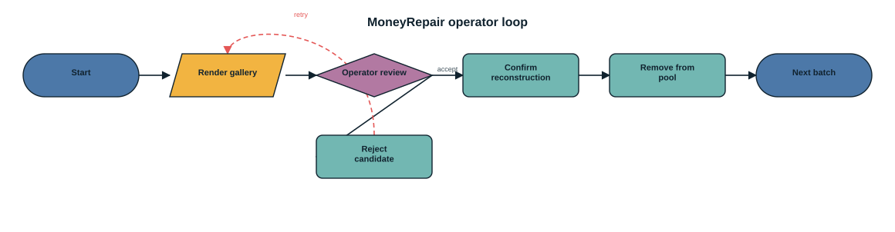
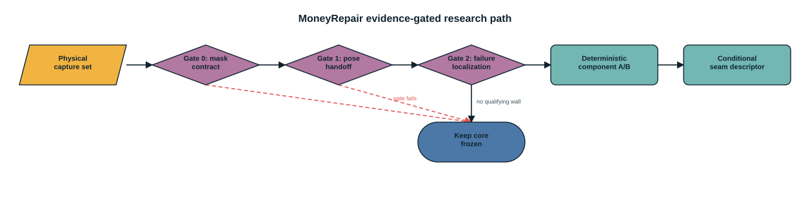

# MoneyRepair Pipeline

MoneyRepair has one supported deterministic path and one explicit evidence
boundary. Raw captures may enter the measurement funnel, but downstream
assembly is trusted only after mask and pose gates pass. `STATUS.md` defines
the current capability claim.


Editable source: [pipeline_diagram.drawio](pipeline_diagram.drawio). The graph
spec is [pipeline_diagram.json](pipeline_diagram.json).

## Stage 0: Coordinate And Tolerance Contract

Before physical capture, freeze:

- physical sheet dimensions and reference image hashes;
- scanner DPI or phone pixel scale and rectification procedure;
- observation-to-canonical transform convention;
- segmentation and registration tolerances in millimetres;
- calibration/evaluation split and repeat aggregation;
- automatic, review, and insufficient-evidence policies.

The minimum effective feature is derived from the physical tolerance model,
not hand-tuned against an evaluation case:

```text
D_min = r_e * (2 * (T_seg + T_reg) + 0.25 * H) + T_seg + T_reg
```

`pilot-init`, `pilot-freeze-coordinate-contract`, and `pilot-validate` create
and audit this contract. Validation inventories evidence; it never fills a
missing capture or estimates a favourable threshold.

## Stage 1: Capture, Segmentation, And Labels

One clear scanner or phone frame may contain many separated fragments.
`segment-scan` extracts connected components, writes RGBA crops and mask PNGs,
and creates an editable manifest. `label-manifest` can assign stable labels
from CSV, file names, IDs, or optional Tesseract OCR.

The production manifest stores observations only:

```json
{
  "note": {"width": 420, "height": 180},
  "references": {
    "front": "references/front.png",
    "back": "references/back.png"
  },
  "fragments": [
    {
      "id": "frag-0001",
      "label": "0001",
      "side": "front",
      "image": "fragments/0001.png",
      "mask": "masks/0001.png"
    }
  ]
}
```

Gold masks and crop-to-canonical transforms belong in a separate evaluation
annotation file. They must not be copied into production fragment metadata.



Editable source: [acquisition_flow.drawio](acquisition_flow.drawio).

## Stage 2: Mask Gate

The mask audit separates error types that have different physical meanings:

- symmetric external-boundary p95 in observation pixels and millimetres;
- interior missing and extraneous area fractions;
- disconnected components and isolated extraneous components;
- internal holes and topology changes;
- descriptive IoU, which is not the sole release criterion.

An input that fails the calibrated mask contract is recaptured or resegmented.
It must not be pushed downstream and hidden by a wider tear tolerance.

## Stage 3: Pose Proposal And Uncertainty

The locator proposes front/back, rotation, and translation in the canonical
note frame. The current v5 alpha measures:

- coarse-lattice population and fixed internal shortlist;
- returned top-K and top-1 recall when evaluation truth is available;
- translation and angular residuals in their correct coordinate frames;
- score margins and observable pose uncertainty;
- transform-family and ranking-stage miss localization;
- automatic pose precision and false-automatic count.

`reality-bridge` routes each fragment as `automatic`, `review`, or
`insufficient-evidence`. Only automatic placements are written to downstream
handoff datasets. The current clean cardinal proxy reaches only `4/8` top-K
recall, and no qualifying physical result exists; this stage is therefore a
measurement gate, not a solved production component.

## Stage 4: Placed Tear Evidence

Once fragments share the canonical frame, `tearfit.py` scores whether two
placed boundaries represent the two sides of one tear. Adaptive `Etear`
combines evidence such as contiguous bidirectional support, matched fraction,
normal opposition, curvature structure, unexplained boundary, overlap, and
pose uncertainty.

Important boundaries:

- this is placed-coordinate tear evidence, not a generic raw-crop contour
  matcher over arbitrary transforms;
- missing tear geometry is never generated or inpainted;
- appearance and wear clustering are not note-identity keys;
- contact amount alone is not tear complementarity.

## Stage 5: Candidate Construction

Automatic tear edges form high-confidence core components. Candidate search is
bounded by deterministic state/node budgets. Whole-assembly gap recovery may
add a fragment when several partial boundaries jointly explain it, even if no
single pair is strong enough.

The frozen v4.4.1 selector uses fragment-disjoint rounds at fixed complete and
partial base limits. This removes the measured global-ranking limiter on one
`N=100`, `p=24`, seed-7 case. Ten notes still lack a pure automatic component
that reaches the core threshold; physical data must reproduce that wall before
another component-construction method is allowed.

## Stage 6: Exact-Cover Selection

The final selector chooses globally consistent candidate notes. It enforces:

- no fragment reuse;
- overlap and compatibility constraints;
- coverage requirements;
- serial/OCR deduplication when labels are legible;
- deterministic tie-breaking and auditable provenance.

The pairwise compatibility matrix is stored with `numpy.packbits`. A
20,000-by-20,000 dense Boolean matrix is about 381 MB, while the packed form is
about 48 MB before `.npz` compression. `estimate-matrix` reports the expected
memory for a requested size.



Editable source: [search_logic.drawio](search_logic.drawio).

## Stage 7: Release Or Review

Automatic confirmation requires the declared evidence gates; otherwise the
candidate remains in a human queue. `batch-next` writes a visual candidate
report. `batch-confirm` records an accepted note and removes its fragments from
future searches; `batch-reject` records a rejected candidate.



Editable source: [operator_loop.drawio](operator_loop.drawio).

## Auditable Run Outputs

`run-pipeline` and related commands write machine-readable artifacts rather
than relying on console summaries. A run manifest should include:

- input path and SHA256;
- exact parameters and requested/actual strategy;
- software/schema version;
- per-stage timing, including preprocessing versus search;
- candidate, coverage, quality, and routing counts;
- output paths and fingerprints;
- whether a limit or timeout truncated the run.

Generated `runs/` outputs are local evidence and are not committed. Curated,
non-private benchmark JSON may be copied to `docs/benchmarks/` only with its
protocol and provenance documented.

## Main Commands

Synthetic smoke test:

```bash
moneyrepair smoke --output-dir runs/smoke --pieces 18 --coverage 0.98
```

Raw-crop handoff audit:

```bash
moneyrepair reality-bridge \
  --manifest runs/capture/manifest.json \
  --annotations runs/capture/annotations.json \
  --reference-front references/front.png \
  --reference-back references/back.png \
  --output-dir runs/capture/reality_audit
```

Pre-aligned production batch:

```bash
moneyrepair run-pipeline \
  --dataset runs/placed_pool.npz \
  --output-dir runs/final \
  --coverage 0.97
```

Raw crops should go through `reality-bridge` first. Appearance discrimination
requires fragments already represented in the template coordinate frame; it
is not a raw-crop auto-location mode.

## Research Gate



Editable source: [research_gates.drawio](research_gates.drawio).

The order is binding: physical mask contract, physical pose handoff, failure
localization, then at most one frozen-variable component A/B. A learned seam
descriptor is conditional on a remaining retrieval residual. If no qualifying
wall recurs, keep the deterministic core frozen.
