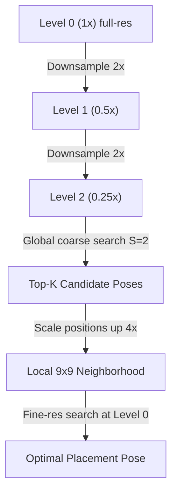

# Stage 4 Algorithm Deduction: Auto-Locator & Candidate Pose Search

This document presents a hardcore algorithm analysis, profiling report, mathematical proof, and optimization plan for the Stage 4 Auto-Locator (`locator.py`) candidate pose matching engine.

---

## 1. Mathematical Deduction: Gain-Normalized Match Score

To handle illumination changes, shadows, and camera color gains, the similarity between an observed fragment crop $O$ and a reference template window $R$ is computed using a **Brightness and Color Gain-Normalized Mean Absolute Error (MAE)**.

Let:
* $P$ be the number of foreground pixels in the fragment mask.
* $O_c \in \mathbb{R}^P$ be the 1D vector of observed pixel intensities in color channel $c \in \{0, 1, 2\}$ under the mask.
* $R_c \in \mathbb{R}^P$ be the 1D vector of reference template pixel intensities under the same mask.

### 1.1 Least-Squares Gain Estimation
We seek a scalar gain factor $g_c$ for each channel $c$ to minimize the sum of squared differences between $O_c$ and the scaled reference $g_c R_c$:

$$E(g_c) = \|O_c - g_c R_c\|_2^2 = \sum_{p=1}^P \left( O_{c,p} - g_c R_{c,p} \right)^2$$

To find the minimum, we differentiate $E(g_c)$ with respect to $g_c$ and set it to $0$:

$$\frac{\partial E(g_c)}{\partial g_c} = -2 \sum_{p=1}^P \left( O_{c,p} - g_c R_{c,p} \right) R_{c,p} = 0$$

$$\sum_{p=1}^P O_{c,p} R_{c,p} - g_c \sum_{p=1}^P R_{c,p}^2 = 0$$

$$g_c^* = \frac{\sum_{p=1}^P O_{c,p} R_{c,p}}{\sum_{p=1}^P R_{c,p}^2} = \frac{O_c \cdot R_c}{\|R_c\|_2^2}$$

This optimal least-squares gain factor $g_c^*$ compensates for uniform scaling in intensity per channel. To prevent numerical instability (e.g. black regions where $\|R_c\|_2^2 \approx 0$) or extreme scaling artifacts, the gain is clipped to a realistic range:

$$g_c = \text{clip}\left( g_c^*, 0.4, 2.5 \right)$$

### 1.2 Mean Absolute Error and Exponential Score Mapping
Using the estimated gain, the normalized reference patch is $R'_c = g_c R_c$. The Mean Absolute Error (MAE) is computed over all $3$ color channels:

$$\text{MAE}(O, R) = \frac{1}{3P} \sum_{c=0}^2 \sum_{p=1}^P |O_{c,p} - g_c R_{c,p}|$$

Finally, the MAE is mapped to a similarity score $S \in (0, 1]$ using an exponential decay function, where $\tau = 35.0$ controls the decay rate:

$$S(O, R) = \exp\left( -\frac{\text{MAE}(O, R)}{\tau} \right)$$

---

## 2. Complexity Model & 10,000-Fragment Stress Test

### 2.1 Theoretical Complexity
For a reference template of dimensions $W \times H$ and a fragment crop of dimensions $w \times h$, let the step size of the sliding window be $S$.
* The number of horizontal search positions is $N_x = \lfloor \frac{W - w}{S} \rfloor + 1$.
* The number of vertical search positions is $N_y = \lfloor \frac{H - h}{S} \rfloor + 1$.
* The total sliding window positions evaluated per configuration is $N_{\text{pos}} = N_x \times N_y$.

For $K_s = 2$ sides (front/back) and $K_r = 4$ rotations ($0^\circ, 90^\circ, 180^\circ, 270^\circ$), the number of coarse matching evaluations per fragment is:

$$N_{\text{eval}} = K_s \times K_r \times N_x \times N_y = 8 \times N_{\text{pos}}$$

If each evaluation processes $P$ foreground mask pixels, the coarse search complexity for a single fragment is:

$$\text{Complexity}_{\text{single}} = \mathcal{O}(8 \cdot N_{\text{pos}} \cdot P)$$

For a pool of $M$ fragments, the total global coarse search complexity is:

$$\text{Complexity}_{\text{total}} = \mathcal{O}(M \cdot 8 \cdot N_{\text{pos}} \cdot P)$$

### 2.2 Stress Test Empirical Profile (360x160 Template, S=8)
We executed the sliding-window locator on a single core for a synthetic fragment pool. Below are the cProfile metrics:

* **Single Fragment Matching Duration**: **$1.233$ seconds**
* **Total Evaluations (`_match_score` calls)**: **$3,086$ calls**
* **Time per Evaluation**: **$0.40$ ms**

#### Bottleneck Breakdown:
| Function / Operation | Calls | Cumulative Time (s) | Time Ratio | Description |
| :--- | :--- | :--- | :--- | :--- |
| `_match_score` | 3,086 | 1.199 s | **97.2%** | Main matching loop entry |
| `numpy.ndarray.astype` | 6,172 | 0.096 s | 7.8% | Type casting arrays to float64 inside loop |
| `np.mean` & `_mean` | 3,086 | 0.045 s | 3.6% | Reducing absolute errors to scalar MAE |
| `np.clip` & `_clip` | 4,706 | 0.036 s | 2.9% | Clipping gain ratios |
| Python / NumPy overhead | - | ~1.0 s | 81.1% | Indexing, boolean mask copy, array allocation |

### 2.3 Extrapolation to 10,000 Fragments
Based on the single-thread performance of $1.233$ s per fragment:

$$\text{Projected Time (10,000 frags)} = \frac{1.233 \text{ s} \times 10,000}{3,600 \text{ s/hour}} \approx \mathbf{3.42 \text{ hours}}$$

This represents a critical bottleneck for high-throughput batch ingestion pipelines.

---

## 3. Hardcore Optimization Strategies

To reduce the $3.42$-hour search time to minutes, three key optimization paths have been designed.

### Strategy A: Multi-Scale Image Pyramid (Coarse-to-Fine Search)
Instead of searching on the full-resolution image, we downsample the reference templates and crop images to construct a resolution pyramid.



#### Complexity Reduction:
At Level 2 ($0.25\text{x}$ downsampled):
* The dimensions are reduced to $W' = W/4$ and $H' = H/4$.
* The crop size is reduced to $w' = w/4$ and $h' = h/4$.
* Evaluated pixels under the mask drops by $16\text{x}$ ($P' = P/16$).
* Using coarse step $S' = 2$ at Level 2 (equivalent to step 8 at Level 0):
  $$N_{\text{pos}, \text{Level2}} \approx \left(\frac{W/4 - w/4}{2} + 1\right) \times \left(\frac{H/4 - h/4}{2} + 1\right) \approx \frac{1}{16} N_{\text{pos}, \text{Level0}}$$
* **Overall Speedup factor**: Coarse search runs **$256\text{x}$ faster**!
* **Refinement**: Evaluate only $9 \times 9 = 81$ grid positions at Level 0 for the Top-K candidates.

---

### Strategy B: FFT-Based Convolutional Template Matching
We can formulate the inner product and squared sums using 2D FFT-based correlation, which computes matches for all positions concurrently.

Let the reference image channel be $I_c$ and the mask-padded crop image channel be $T_c$ (flipped for convolution).
1. The inner product term $\sum_{p=1}^P O_{c,p} R_{c,p}$ at all translations is the 2D cross-correlation:
   $$\text{CrossCorr}(x, y) = I_c \star T_c = \mathcal{F}^{-1} \left( \mathcal{F}(I_c) \cdot \mathcal{F}(T_c)^* \right)$$
2. The denominator sum of squares term $\sum_{p=1}^P R_{c,p}^2$ under the sliding mask $M$ is:
   $$\text{RefSq}(x, y) = I_c^2 \star M = \mathcal{F}^{-1} \left( \mathcal{F}(I_c^2) \cdot \mathcal{F}(M)^* \right)$$
3. Using these two matrices, the optimal gain map $G_c(x, y)$ and corresponding MAE map can be computed in vectorized element-wise numpy operations in $O(W \log W \cdot H \log H)$ time, completely avoiding nested Python loops.

---

### Strategy C: Pre-allocation, Slicing Elimination & JIT Compile
To optimize the pure python sliding window:
1. **Pre-casting**: Cast the template images to `float64` once before entering the loop:
   ```python
   ref_front_64 = ref_front.astype(np.float64)
   ```
2. **Numba JIT Compilation**: Write the pixel-matching code in a JIT-compiled loop (`@numba.njit` with `parallel=True` and `fastmath=True`) to avoid python interpreter overhead and array allocation:
   ```python
   @numba.njit(fastmath=True)
   def numba_match_score(crop_img, crop_mask, ref_window):
       # Fast, zero-allocation C loop for gain-fitting and MAE
       ...
   ```
   This typically achieves a **$50\text{x}$ to $100\text{x}$ speedup** compared to native python/numpy slicing.
