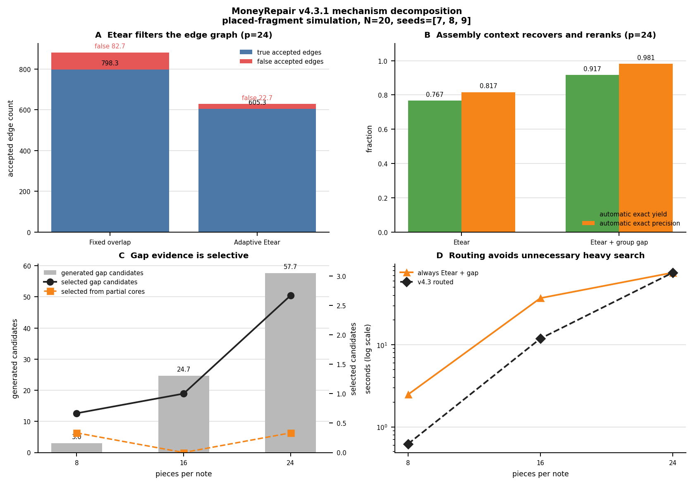

# v4.3.1: Mechanism Validation

> Simulation evidence only. This report uses placed fragments in a shared note
> coordinate frame. It does not include raw-crop localization, OCR errors,
> continuous-angle pose uncertainty, or real paper fibres.

## Question

v4.3 introduced adaptive tear evidence, whole-assembly gap reasoning, and a
complexity route. v4.3.1 does not add another discriminator. It audits which
stage changes the result:

1. `baseline -> effectiveness`: adaptive edge filtering;
2. `effectiveness -> effectiveness_gap`: assembly-level gap recovery;
3. `effectiveness_gap -> v43_routed`: regime selection.

The checked-in JSON now records true and false accepted edges, candidate
provenance, selected core/gap candidates, stage-level search counters, and
machine-readable deltas for all three comparisons.

## Reproducible protocol

```bash
moneyrepair tearfit-v43-ablation \
  --notes 20 \
  --pieces-list 8,16,24 \
  --seeds 7,8,9 \
  --algorithms baseline,effectiveness,effectiveness_gap,v43_routed \
  --candidate-state-limit 100000 \
  --gap-state-limit 20000 \
  --partial-gap-state-limit 5000 \
  --cover-node-limit 250000 \
  --no-time-limits \
  --output docs/benchmarks/v4_3_geometry_ablation.json
```

The result is conditioned on fixed search budgets. Every exact-cover run reached
the `250000` node budget. At p=24, all baseline core searches, and one of three
adaptive core searches, reached the `100000` state budget. No run reached a
wall-clock limit. Quality changes therefore describe performance under an equal
compute contract, including relief from candidate-search congestion.

## Head-to-head result

Mean over seeds 7, 8, and 9; geometry only, no serial labels:

| pieces | algorithm | auto yield | auto precision | false-edge rate | accepted edges | candidates | manual notes | seconds |
| ---: | --- | ---: | ---: | ---: | ---: | ---: | ---: | ---: |
| 8 | baseline | 1.000 | 1.000 | 0.069 | 256.7 | 58.3 | 0.0 | 0.62 |
| 8 | effectiveness | 0.917 | 0.982 | 0.002 | 194.7 | 40.3 | 1.7 | 0.79 |
| 8 | effectiveness + gap | 0.950 | 1.000 | 0.002 | 194.7 | 43.3 | 1.0 | 2.48 |
| 8 | v4.3 routed | 1.000 | 1.000 | 0.069 | 256.7 | 58.3 | 0.0 | 0.62 |
| 16 | baseline | 1.000 | 1.000 | 0.086 | 560.3 | 1108.0 | 0.0 | 11.90 |
| 16 | effectiveness | 0.933 | 0.949 | 0.011 | 395.7 | 589.3 | 1.3 | 4.42 |
| 16 | effectiveness + gap | 0.983 | 1.000 | 0.011 | 395.7 | 614.0 | 0.3 | 37.01 |
| 16 | v4.3 routed | 1.000 | 1.000 | 0.086 | 560.3 | 1108.0 | 0.0 | 11.90 |
| 24 | baseline | 0.533 | 0.846 | 0.094 | 881.0 | 9581.3 | 9.3 | 33.44 |
| 24 | effectiveness | 0.767 | 0.817 | 0.036 | 628.0 | 5519.3 | 4.7 | 20.20 |
| 24 | effectiveness + gap | **0.917** | **0.981** | **0.036** | 628.0 | 5577.0 | **1.7** | 75.66 |
| 24 | v4.3 routed | **0.917** | **0.981** | **0.036** | 628.0 | 5577.0 | **1.7** | 75.66 |



## A. What Etear contributes

At p=24, adaptive scoring changes the accepted graph from `881.0` to `628.0`
edges. False accepted edges fall from `82.7` to `22.7`, a 72.6% reduction, and
the false-edge rate falls from `0.094` to `0.036`. Candidate count falls 42.4%,
from `9581.3` to `5519.3`.

That graph cleanup raises automatic yield from `0.533` to `0.767` under the
fixed search budget, but automatic precision changes from `0.846` to `0.817`.
The honest mechanism claim is therefore narrower than "Etear improves
precision": it removes many accidental edges and reduces search congestion,
but the scalar edge gate alone does not reliably rank the final assemblies.

At p=8 and p=16 the fixed-overlap graph is already sufficient for exact cover.
Using Etear there discards useful evidence and leaves more notes for review.

## B. What group-gap contributes

At p=24, adding whole-assembly gap evidence to the same Etear graph adds only
`57.7` candidates on average, a 1.0% increase over the Etear candidate pool.
Exact cover selects `2.7` of those added candidates. This raises yield from
`0.767` to `0.917`, raises precision from `0.817` to `0.981`, and reduces the
manual queue from `4.7` to `1.7` notes.

Gap recovery is therefore not recall-only in this benchmark. The added
multi-seam candidates both recover missing true assemblies and displace
lower-quality complete candidates during global selection.

The low-coverage partial-core path generates many candidates but is not the
main measured lever: only `0.3` selected candidates per p=24 run are unique to
partial cores. Most selected gap assemblies come from completing cores that
already reached the normal candidate threshold.

## C. What routing contributes

Routing does not create a fifth reconstruction method. It selects an existing
path from median fragment area:

- p=8 and p=16 resolve to `baseline`;
- p=24 resolves to `effectiveness_gap`.

Consequently, p=24 routed output is bit-for-bit the reused group-gap trial. On
p=8 and p=16, routing avoids a heavy path that is slower and slightly worse in
yield: runtime falls from `2.48` to `0.62` seconds at p=8 and from `37.01` to
`11.90` seconds at p=16, while restoring automatic yield to `1.000`.

The route deliberately tolerates a higher edge-level false-positive rate in
the easy regimes because exact cover already removes those edges without
hurting final precision. Its value is avoiding unnecessary conservatism and
cost, not improving the same underlying trial after it has run.

## Decision

v4.3 works for three distinct reasons under the measured N=20 contract:

1. Etear reduces the hard-regime edge graph and candidate congestion.
2. Group-gap supplies a small number of globally supported candidates that
   improve both recovery and final selection.
3. Routing keeps that expensive logic away from regimes where fixed overlap is
   already exact.

This closes the v4.3.1 mechanism question. It does not establish scale
robustness. The next gated experiment is p=24 at N=20/50/100/200 with the same
state/node budgets, followed by tear-model and edge-dropout stress. A learned
descriptor remains deferred until those tests identify a residual signal wall.
