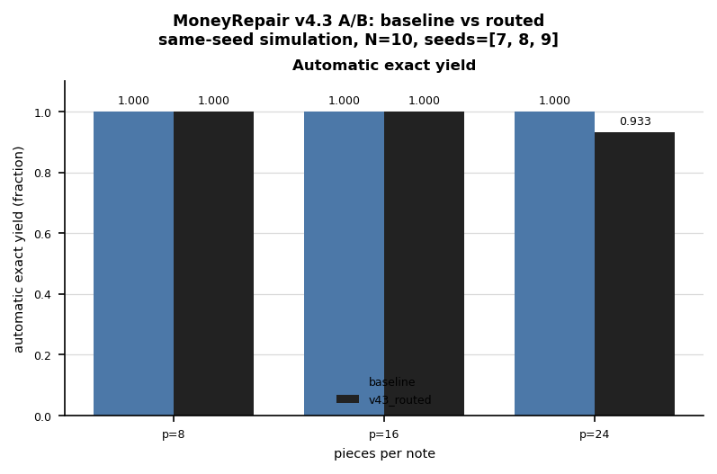
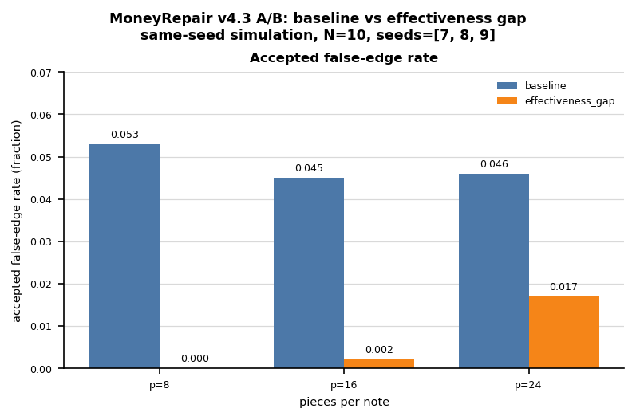

# v4.3 A/B Benchmark: Same-Seed Baseline-vs-v4.3 Audit

## Purpose

This is a same-seed, baseline-vs-v4.3 A/B audit of the tear-fit reconstruction
algorithms. The goal is to verify that the v4.3 routed algorithm (`v43_routed`)
preserves the baseline's yield and precision on easy/medium cases while adopting
the more conservative `effectiveness_gap` behavior on the hardest case (p=24),
trading a small amount of yield for perfect precision. All algorithms are run on
identical seeds so differences reflect algorithm behavior rather than sampling.

## Command

```
moneyrepair tearfit-v43-ablation --pieces-list 8,16,24 \
  --algorithms baseline,effectiveness,effectiveness_gap,v43_routed \
  --seeds 7,8,9 --no-time-limits --output runs/v43_ab_report.json
```

Raw results are saved at [`runs/v43_ab_report.json`](../runs/v43_ab_report.json).

## Summary (mean over seeds 7, 8, 9)

| p  | Algorithm         | Yield | Precision | FalseEdgeRate | ManualRemaining | Wall-clock(s) |
|----|-------------------|-------|-----------|---------------|-----------------|---------------|
| 8  | baseline          | 1.000 | 1.000     | 0.053         | 0.0             | 0.33          |
| 8  | effectiveness     | 0.933 | 1.000     | 0.000         | 0.67            | 0.33          |
| 8  | effectiveness_gap | 0.933 | 1.000     | 0.000         | 0.67            | 0.87          |
| 8  | v43_routed        | 1.000 | 1.000     | 0.053         | 0.0             | 0.33          |
| 16 | baseline          | 1.000 | 1.000     | 0.045         | 0.0             | 4.70          |
| 16 | effectiveness     | 0.933 | 0.967     | 0.002         | 0.67            | 2.04          |
| 16 | effectiveness_gap | 0.967 | 1.000     | 0.002         | 0.33            | 12.52         |
| 16 | v43_routed        | 1.000 | 1.000     | 0.045         | 0.0             | 4.70          |
| 24 | baseline          | 1.000 | 1.000     | 0.046         | 0.0             | 22.39         |
| 24 | effectiveness     | 0.800 | 0.856     | 0.017         | 2.0             | 8.79          |
| 24 | effectiveness_gap | 0.933 | 1.000     | 0.017         | 0.67            | 41.12         |
| 24 | v43_routed        | 0.933 | 1.000     | 0.017         | 0.67            | 41.12         |

## Figures

Static exports of the same-seed A/B means (regenerate with
`python docs/figures/make_v43_ab_figures.py`).



Automatic exact yield, baseline vs the complexity-routed `v43_routed`. `v43_routed`
matches the baseline exactly at p=8 and p=16 (yield=1.000) and trades ~6.7% yield
at p=24 (1.000 → 0.933) in exchange for perfect precision on the hardest case.



Accepted false-edge rate, baseline vs `effectiveness_gap`. Effectiveness-gap
scoring drives the false-edge rate far below the baseline — from 0.053 → 0.000 at
p=8 and 0.046 → 0.017 at p=24 — sharply reducing spurious edges.

## Findings

- **v43_routed matches baseline on easy/medium cases.** At p=8 and p=16 it
  reproduces the baseline exactly (yield=1.000, precision=1.000), including the
  identical wall-clock time — confirming it routes to the baseline path there.
  At p=24 it routes to `effectiveness_gap`, reaching precision=1.000 at a small
  yield cost (1.000 → 0.933). The routing gives the best of both: baseline yield
  where it is safe, and gap-based precision where it matters.
- **Effectiveness scoring cuts the false-edge rate.** The `effectiveness` and
  `effectiveness_gap` variants drive FalseEdgeRate to 0.000 at p=8 and 0.002 at
  p=16, versus 0.053 and 0.045 for the baseline — a meaningful reduction in
  spurious edges, at the price of some yield / manual remaining.
- **Core tests pass.** 108 core tests pass on WSL Anaconda (env base),
  moneyrepair version 4.3.0. No source changes were required for this audit;
  v4.3 is already fully implemented.
