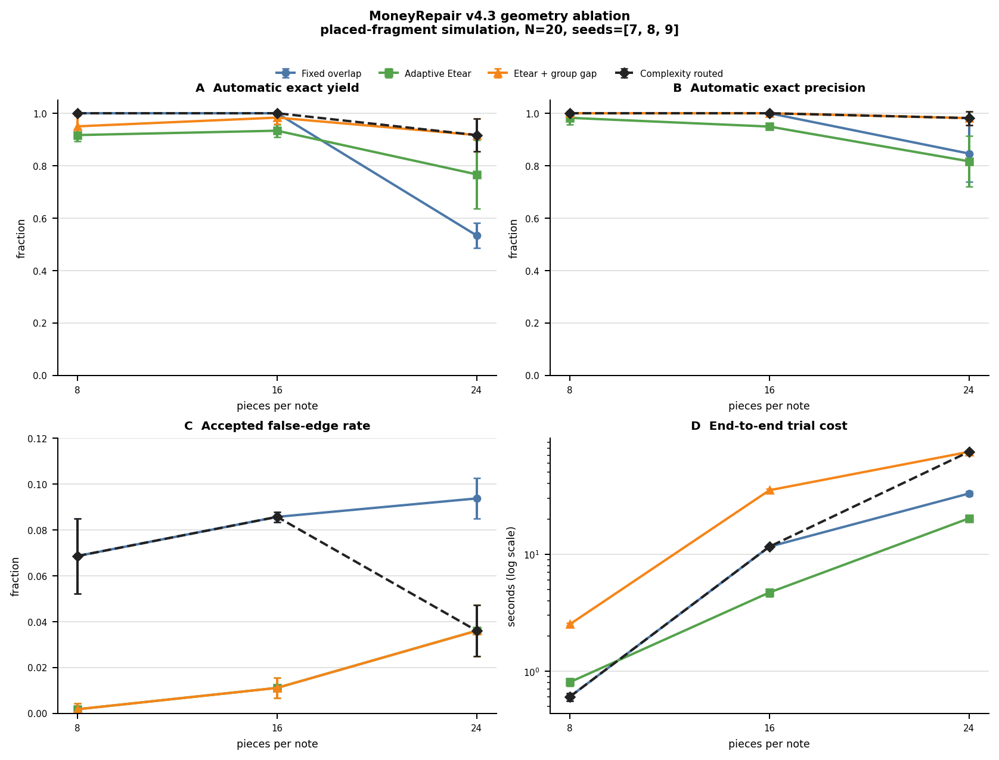

# v4.3: Adaptive Tear Evidence and Group-Gap Recovery

> Research result, not a field-performance claim. Every number below comes
> from placed-fragment fractal-tear simulation. Raw-crop localization, OCR
> errors, continuous-angle pose refinement, and real paper fibres are excluded.

## Why this iteration exists

The fixed tear rule accepted a pair when its two dilated boundaries shared at
least `min_overlap_pixels`. That rule cannot distinguish a short, coherent seam
from scattered accidental hits. v4.3 adapts the decision framework in
[Kachkine (2025)](https://doi.org/10.1038/s41586-025-09045-4): alignment
tolerance should determine the smallest trustworthy evidence, and uncertain
features should be routed to review rather than forced through one threshold.

This is an adaptation of the paper's engineering logic. `Etear` is not the
paper's physical restoration-effectiveness equation, and MoneyRepair makes no
claim that the two metrics are mathematically interchangeable.

## Adaptive edge score

For one placed fragment pair, let:

- `M` be bidirectional boundary overlap;
- `C` be the largest connected matched boundary segment;
- `L` and `R` be one-sided hit counts;
- `N` be opposing-normal agreement in `[0, 1]`;
- `K` be raster curvature entropy in `[0, 1]`;
- `P` be the explained-perimeter factor;
- `A` be expected accidental hits from boundary density;
- `O` be physical mask overlap;
- `U` be normalized locator uncertainty in `[0, 1]`.

The implemented score is:

```text
balance     = M / max(L, R)
geometry    = 0.5 + 0.5 N
specificity = 0.75 + 0.5 K
perimeter   = clip((M / min(perimeter_left, perimeter_right)) / 0.30, 0.25, 1.5)

benefit = C * balance * geometry * specificity * perimeter
damage  = 1 + (M - C) + abs(L - R) + 2 O + A

Etear = benefit / damage * (1 - 0.5 U)
```

Default evidence routing is:

| Decision | Condition |
| --- | --- |
| `automatic` | `Etear >= 2.0` and `C >= 5` |
| `review` | `Etear >= 1.0` and `C >= 3` |
| `insufficient-evidence` | otherwise |

Only `automatic` edges build the high-confidence core graph. Review edges may
support the second-stage group fit but cannot independently start a core.

## Core then group-gap

The second stage scores a fragment against the whole partial assembly:

```text
G = 0.15 * gap_fill_ratio
  + 0.25 * min(seam_count / 2, 1)
  + 0.25 * matched_perimeter_ratio
  + 0.25 * mean(Etear / (1 + Etear))
  - 0.35 * overlap_ratio
  - 0.10 * unmatched_perimeter_ratio
  - 0.15 * pose_uncertainty
```

At least two independent supporting seams are required for automatic group-gap
acceptance. Candidate generation retains high-confidence partial cores from
raw coverage `0.78` upward, while exact-cover only sees assemblies reaching the
target coverage `0.93`. Complete core candidates are preserved before gap
augmentation, preventing the second stage from erasing a valid core-only result.

## Pose uncertainty and triage

`CandidatePose` now records `sigma_x`, `sigma_y`, score margin, and local basin
sample count. These fields are propagated to placed fragments and reduce
`Etear`/group evidence when the locator peak is broad. `sigma_theta` remains
`null`: the current locator only searches cardinal rotations, so continuous
angular uncertainty cannot yet be estimated honestly.

Selected candidates are reported as `automatic` or `review`. A correct review
candidate does not reduce `manual_notes_remaining`; this keeps the automatic
yield and human queue mathematically consistent.

## Reproducible head-to-head

Generate the checked-in benchmark with deterministic search budgets:

```bash
moneyrepair tearfit-v43-ablation \
  --notes 20 \
  --pieces-list 8,16,24 \
  --seeds 7,8,9 \
  --algorithms baseline,effectiveness,effectiveness_gap,v43_routed \
  --candidate-state-limit 100000 \
  --gap-state-limit 20000 \
  --partial-gap-state-limit 5000 \
  --cover-node-limit 250000 \
  --no-time-limits \
  --output docs/benchmarks/v4_3_geometry_ablation.json
```

The state/node budgets determine the result; wall time is only a cost metric.
The checked-in rows contain per-stage counters and budget-stop reasons. No run
in the table below hit a wall-clock limit.

### Measured result

Mean over seeds `7,8,9`, `N=20`, geometry only, no serial labels:

| pieces | algorithm | auto yield | auto precision | false-edge rate | manual notes | seconds |
| ---: | --- | ---: | ---: | ---: | ---: | ---: |
| 8 | fixed overlap | 1.000 | 1.000 | 0.069 | 0.0 | 0.60 |
| 8 | adaptive Etear | 0.917 | 0.982 | 0.002 | 1.7 | 0.80 |
| 8 | Etear + group gap | 0.950 | 1.000 | 0.002 | 1.0 | 2.51 |
| 16 | fixed overlap | 1.000 | 1.000 | 0.086 | 0.0 | 11.57 |
| 16 | adaptive Etear | 0.933 | 0.949 | 0.011 | 1.3 | 4.70 |
| 16 | Etear + group gap | 0.983 | 1.000 | 0.011 | 0.3 | 35.16 |
| 24 | fixed overlap | 0.533 | 0.846 | 0.094 | 9.3 | 32.95 |
| 24 | adaptive Etear | 0.767 | 0.817 | 0.036 | 4.7 | 20.20 |
| 24 | Etear + group gap | **0.917** | **0.981** | **0.036** | **1.7** | 74.88 |

The complexity-routed policy uses fixed overlap when median fragment area is at
least `5%` of the note and Etear + group gap below that boundary. It therefore
matches baseline at pieces `8/16` and selects the heavy path at pieces `24`.



## What the ablation actually proves

- Fixed overlap remains the right choice for the easy p=8 and p=16 cases in
  this configuration.
- At p=24, Etear cuts accepted false edges by about 62%, but Etear alone trades
  away precision. Group-level evidence recovers the missing pieces and raises
  automatic yield from `0.533` to `0.917` while raising precision from `0.846`
  to `0.981` under the same deterministic budgets.
- The heavy path costs about 2.3 times baseline wall time at p=24.
- At p=24, the partial-core stage generated an average of 34.3 candidates not
  produced from complete cores, but exact-cover selected only 0.33 per run.
  Most measured gain therefore came from adaptive core edges plus group-gap
  completion of near-complete cores. General low-coverage core filling is wired
  and audited, but this benchmark does not yet prove it is the main lever.

## Remaining boundary

This result moves the simulated fineness wall at `N=20`; it does not remove it.
The next evidence-bearing steps are real torn-note capture, continuous-angle
pose refinement with calibrated uncertainty, and only then a narrow learned
descriptor for short ambiguous tear segments. Missing tear geometry must not be
generated or hallucinated. Colour and wear remain localization/tie-break signals,
not same-note identity evidence.

Physical infill masks are deliberately downstream of identity reconstruction.
They may be useful once assemblies and alignment tolerances are validated, but
they cannot repair uncertainty in which physical fragments belong together.
